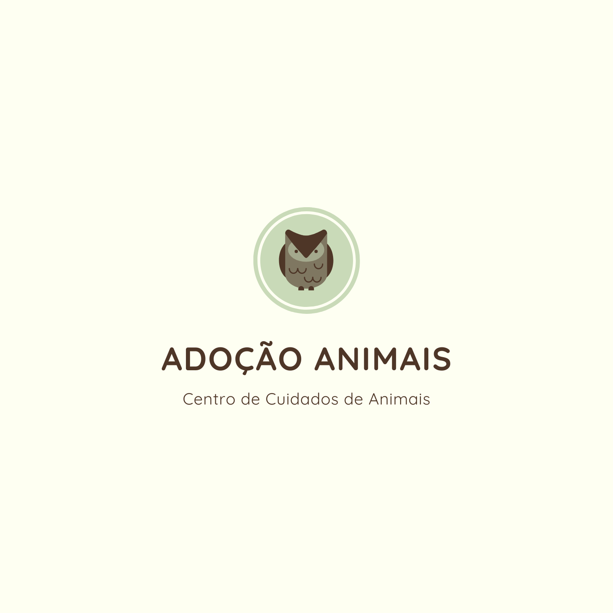
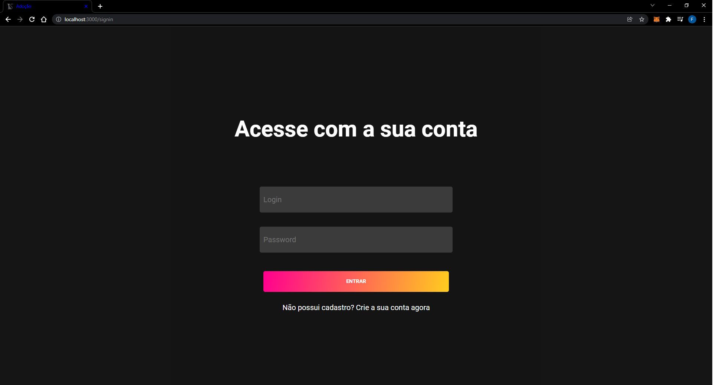
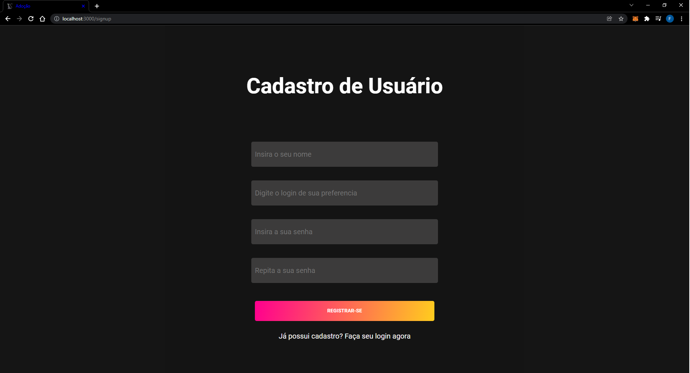
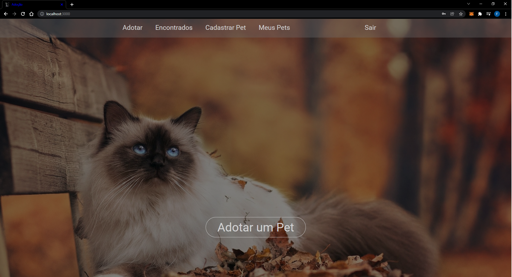
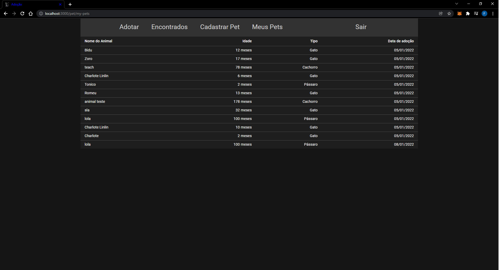
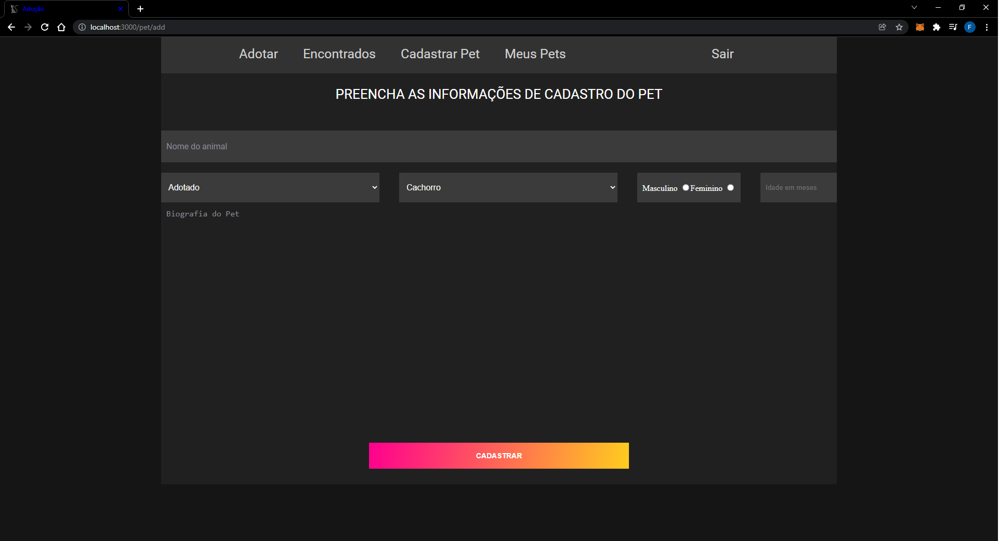
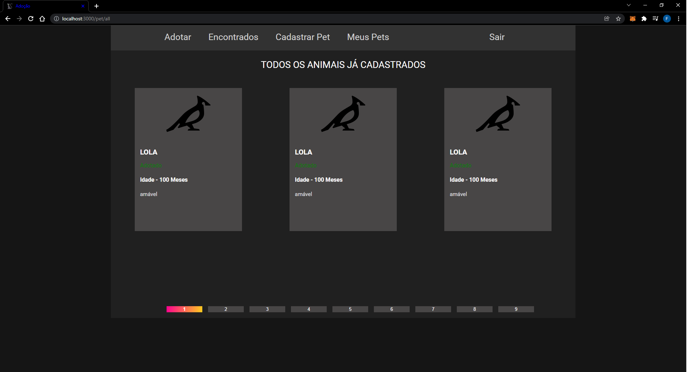
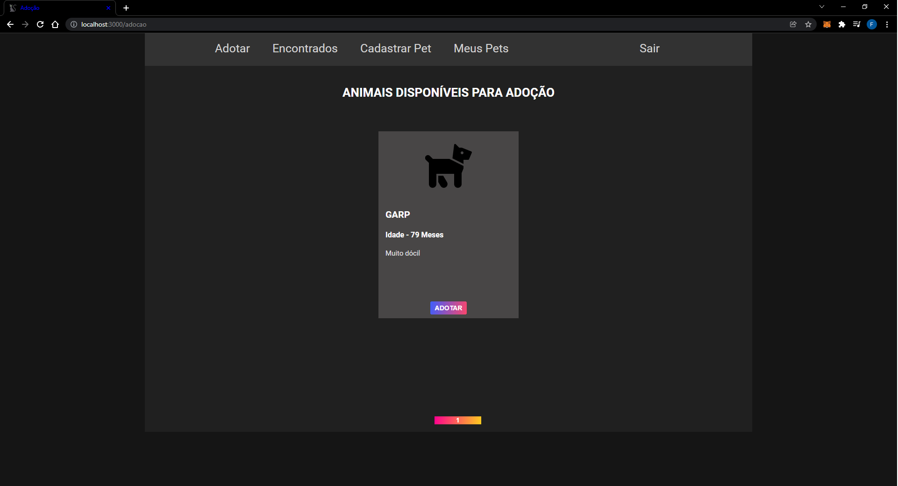

# ADOCAO ANIMAIS FRONTEND

<h1 align="center">
    
</h1>

## Descrição do Projeto
Esse projeto é a interface grafica do sistema de Adoção de animais, utilizando 
a [API](https://github.com/felippepg/api-adocao-animais) feita em Node.
Para a criação desse projeto foi utilizado o React juntamente com o Typescript.

### Pré-requisitos

Antes de começar, você vai precisar ter instalado em sua máquina as seguintes ferramentas:
[Git](https://git-scm.com). 
Além disto é bom ter um editor para trabalhar com o código como [VSCode](https://code.visualstudio.com/)

### 🎲 Rodando a Projeto

```bash
# Clone este repositório
$ git clone <https://github.com/felippepg/adocao-animais-frontend>

# Acesse a pasta do projeto no terminal/cmd
$ cd adocao-animais-frontend

# Baixar todas as dependencias necessárias para rodar o projeto
$ yarn OU npm install (dependendo do seu gerenciador de pacotes)

# Antes de iniciar o projeto certifique-se que API está em funcionamento

# Para iniciar o projeto em modo de desenvolvedor 
$ yarn dev ou npm run dev
```

### :computer: Login

<h1 align="center">
    
</h1>

### :computer: Cadastro 

<h1 align="center">
    
</h1>

### :computer: Home

<h1 align="center">
    
</h1>

### :computer: Meus Pets

<h1 align="center">
    
</h1>

### :computer: Cadastro de Pet

<h1 align="center">
    
</h1>

### :computer: Encontrados

<h1 align="center">
    
</h1>

### :computer: Adotar

<h1 align="center">
    
</h1>

## 🛠 Tecnologias

As seguintes tecnologias foram usadas na construção da API:

- [REACT.JS](https://pt-br.reactjs.org/)
- [SASS](https://sass-lang.com/)
- [TYPESCRIPT](https://www.typescriptlang.org/)
- [NODE.JS](https://nodejs.org/en/)
- [VITE](https://vitejs.dev/)
- [AXIOS](https://axios-http.com/)
- [MATERIAL-UI](https://mui.com/pt/)


## Features

- [x] Cadastrar animais
- [x] Cadastrar usuários
- [x] Adotar animais
- [x] Paginação de registros

